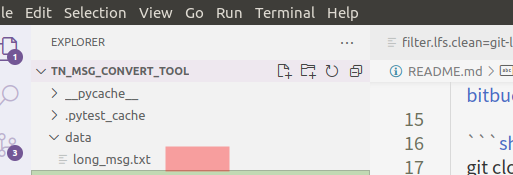

# TN MSG Convert Tool Guide

## Background

Since we need to prepare some of the messages in the testing process for integration test cases, both for input and output messages. And these messages are all in protobuf's ShortDebugString format. It's not so easy to modify and check the messages in this kind of format. But protobuf also provide a common DebugString format, it's easy to modify and check and see the whole structure of the data.  

You can get the common DebugString using "./tmq_topic echo -t {topic_name}" command, then edit it in this human readable format and use this tool to convert the common DebugString to ShortDebugString.

And this functionality will integrate to the case editor in the future with common DebugString as a standard input.

## Steps
+ Clone the project to local

    Currently, I just the put the project on the public github. If we have further concerns about this, I can create a private repo on company's bitbucket.

    ```shell
    git clone https://github.com/zhuge20100104/tn_msg_convert_tool.git
    ```
    
+ Get a message from the corresponding topic using "tmq_topic echo" command.
    You can get the messages from the corresponding machine which runs APA system using "tmq_topic echo" command. Here take "SurroundViewCameraFrames" as an example. 

    ```shell
    ./tmq_topic echo -t SurroundViewCameraFrames
    ```

    This command will output the message body,  choose the message you need and save it in a txt file.

+ Put your message under the data folder with a ".txt" extension.
    Put the txt file you've got in the last step into the data folder as below. You can choose any name as you want. And you can put several txt files in the folder, the convertor will convert them one by one.

    
    

+ Run the test and get your ShortDebugString in the console.
    Run the convertor and check the result on the console.
    ```shell
    pytest -sv conv_msg_test.py::test_convert_long_msg_to_short
    ```